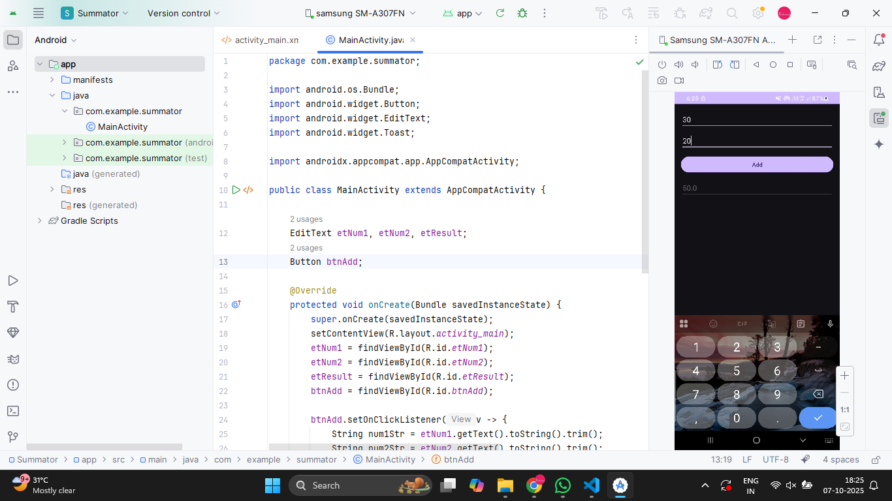
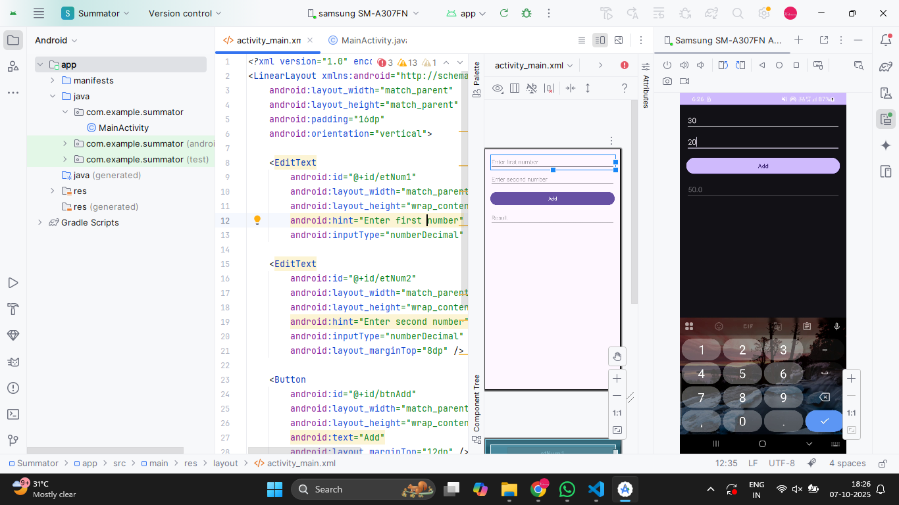

# Workshop-Create a application for addition of two numbers

## AIM:

To create a application for addition of two numbers using Android Studio


## EQUIPMENTS REQUIRED:

Latest Version Android Studio

## ALGORITHM:
Step 1: Open Android Stdio and then click on File -> New -> New project.

Step 2: Then type the Application name as `Summator` and click Next. 

Step 3: Then select the Minimum SDK as shown below and click Next.

Step 4: Then select the Empty Activity and click Next. Finally click Finish.

Step 5: Design layout in activity_main.xml.

Step 6: Get contacts details and Display details give in MainActivity file.

Step 7: Save and run the application.


## PROGRAM:
* Developed by : VISHWARAJ G
* Registeration Number : 212223220125
#### 1. MainActivity.java
```
package com.example.summator;

import android.os.Bundle;
import android.widget.Button;
import android.widget.EditText;
import android.widget.Toast;

import androidx.appcompat.app.AppCompatActivity;

public class MainActivity extends AppCompatActivity {

    EditText etNum1, etNum2, etResult;
    Button btnAdd;

    @Override
    protected void onCreate(Bundle savedInstanceState) {
        super.onCreate(savedInstanceState);
        setContentView(R.layout.activity_main);
        etNum1 = findViewById(R.id.etNum1);
        etNum2 = findViewById(R.id.etNum2);
        etResult = findViewById(R.id.etResult);
        btnAdd = findViewById(R.id.btnAdd);

        btnAdd.setOnClickListener(v -> {
            String num1Str = etNum1.getText().toString().trim();
            String num2Str = etNum2.getText().toString().trim();

            if (num1Str.isEmpty() || num2Str.isEmpty()) {
                Toast.makeText(MainActivity.this, "Enter both numbers", Toast.LENGTH_SHORT).show();
                return;
            }

            try {
                double num1 = Double.parseDouble(num1Str);
                double num2 = Double.parseDouble(num2Str);

                double sum = num1 + num2;
                etResult.setText(String.valueOf(sum));
            } catch (NumberFormatException e) {
                Toast.makeText(MainActivity.this, "Invalid number", Toast.LENGTH_SHORT).show();
            }
        });
    }
}
```

## OUTPUT

#### Coding Part


#### Design_Part


#### Task1


## RESULT
Thus a Simple Android Application for addition of two numbers using Android Studio is developed and executed successfully.


